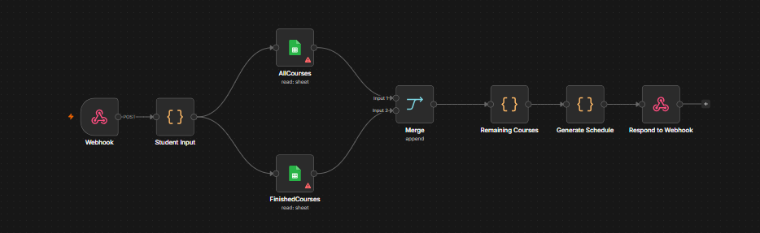

# 🎓 Smart Academic Timetable Generator & Automation System

An end-to-end full-stack automation tool designed to generate conflict-free academic university schedules dynamically. 

The system links a lightweight front-end web application with an **n8n Workflow Automation Backend** that interacts with Google Sheets database layers to handle prerequisite validation, credit hour logic, and scheduling constraint algorithms.

---

## 🔄 Workflow Architecture

---

## 🛠️ Tech Stack & Architecture

* **Front-End:** HTML5, CSS3, JavaScript (ES6+ Async/Fetch API)
* **Back-End Orchestration:** n8n (Workflow Automation Platform)
* **Database Layer:** Google Sheets (Live sync for `AllCourses` & `FinishedCourses`)
* **Core Logic:** Recursive Backtracking for Schedule Conflict Resolution (JavaScript)

---

## ⚡ Key Features

1. **Student Request Processing:** Receives inputs (`studentId`, `major`, `desiredHours`, `pattern`) via HTTP POST Webhook.
2. **Database Merging & Filtering:** Dynamically filters completed courses (`FinishedCourses`) per student ID and enforces prerequisite constraints.
3. **Conflict Resolution Engine:** Converts class timings into operational minutes and executes a recursive search algorithm to construct optimal schedules.
4. **Asynchronous UI Rendering:** Dynamic JSON response parsing that renders dynamic timetable summary tables back to the student interface.

---

## 🚀 How to Run

1. Import `n8n_workflow.json` into your **n8n** instance and connect Google Sheets credentials.
2. Update the `WEBHOOK_URL` in `index.html` with your active n8n Webhook Endpoint.
3. Open `index.html` in any web browser.
